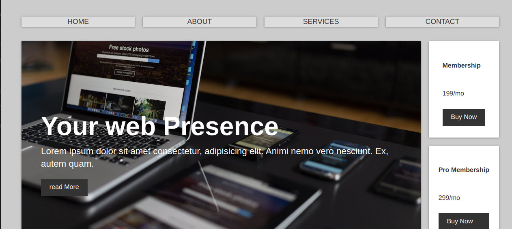

# Home page

- This is Subscription page

## screenshot

## Links

- solution url [ Click me ](https://nicholasbarkote.github.io/showcase/)

## what i learned 

- In this project i learned how to use flexbox and how flex-box direction works on a project.
- Using justify content was another property that i learned using in this project.

# Built With

1. HTML
2. CSS

## what i learned 

- In this project i learned how to use flexbox and how flex-box direction works on a project.
- Using justify content was another property that i learned using in this project.

## Author

<a href="mailto:nicholas.kebut@thejitu.com">nicholas.kebut@thejitu.com</a>

## License

© Nicholas k Barkote

Licensed under the [MIT License](LICENSE)